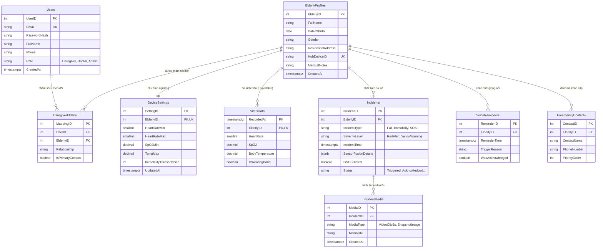

# 🗄️ Thiết Kế Cơ Sở Dữ Liệu - Smart Elderly Care AI

> **Hệ quản trị CSDL:** PostgreSQL 16 + TimescaleDB  
> **Nhóm thực hiện:** C1SE.34  
> **File script thực thi:** [`database_schema.sql`](database_schema.sql) hoặc [`backend/database/schema.sql`](../../smart-elderly-care-ai/backend/database/schema.sql)

---

## 📌 1. Tổng Quan Kiến Trúc CSDL

Cơ sở dữ liệu của hệ thống **Smart Elderly Care AI** được thiết kế theo mô hình lai (Hybrid Relational & Time-Series):
1. **Dữ liệu quan hệ (Relational Data):** Quản lý thông tin tài khoản, người cao tuổi, thiết lập ngưỡng y tế, người liên hệ khẩn cấp và phân quyền.
2. **Dữ liệu chuỗi thời gian (Time-Series Data - TimescaleDB Hypertable):** Quản lý dữ liệu sinh hiệu (`VitalsData`: SpO2, nhịp tim, nhiệt độ) với tần suất cao từ vòng đeo tay BLE. Phân vùng tự động theo ngày (`chunk_time_interval => '1 day'`) giúp tăng tốc độ truy vấn biểu đồ thời gian thực.
3. **Dữ liệu bán cấu trúc (JSONB):** Lưu trữ kết quả AI Sensor Fusion (`SensorFusionDetails` trong bảng `Incidents`) kết hợp giữa camera YOLOv8, âm thanh YAMNet và cảm biến nhiệt.

---

## 📊 2. Sơ Đồ Thực Thể Liên Kết (ERD)



---

## 📑 3. Danh Sách 9 Bảng Chi Tiết

| STT | Tên Bảng | Loại Bảng | Mục Đích |
| :---: | :--- | :---: | :--- |
| **1** | `Users` | Relational | Tài khoản người dùng (Người chăm sóc, Bác sĩ, Quản trị viên). |
| **2** | `ElderlyProfiles` | Relational | Hồ sơ người cao tuổi, gắn liền với mã trạm `HubDeviceID`. |
| **3** | `CaregiverElderly` | Quan hệ N-N | Phân quyền một người chăm sóc nhiều cụ hoặc một cụ có nhiều người thân theo dõi. |
| **4** | `DeviceSettings` | Quan hệ 1-1 | Ngưỡng sinh hiệu cá nhân hóa (nhịp tim, SpO2, nhiệt độ, thời gian bất động). |
| **5** | `VitalsData` | **TimescaleDB Hypertable** | Sinh hiệu đo liên tục từ vòng đeo tay BLE (SpO2, HeartRate, Temp). |
| **6** | `Incidents` | Relational + JSONB | Lịch sử cảnh báo khẩn cấp (Té ngã, Bất động, Sốt cao, Khó thở, SOS) & trạng thái xử lý. |
| **7** | `IncidentMedia` | Relational | Đường dẫn hình ảnh chụp tức thì & video clip 5 giây lưu trên MinIO S3. |
| **8** | `VoiceReminders` | Relational | Lịch sử phát loa nhắc nhở tự động từ Edge Hub (uống thuốc, uống nước, vận động). |
| **9** | `EmergencyContacts`| Relational | Danh sách số điện thoại gọi khẩn cấp theo thứ tự ưu tiên khi có RedAlert. |

---

## 🚀 4. Hướng Dẫn Chạy & Kiểm Thử Script Trên Docker

### Cách 1: Nạp script trực tiếp vào container TimescaleDB
Khi đang ở thư mục gốc của project:
```bash
# Di chuyển vào thư mục chứa docker-compose
cd smart-elderly-care-ai

# Chạy container TimescaleDB (nếu chưa chạy)
docker-compose up -d timescaledb

# Chạy script SQL vào database 'elderly_care'
docker exec -i elderly_care_timescaledb psql -U postgres -d elderly_care < ../docs/database/database_schema.sql
```

### Cách 2: Chạy qua công cụ quản lý GUI (DBeaver / DataGrip / pgAdmin)
- **Host:** `localhost`
- **Port:** `5433` (như cấu hình trong `docker-compose.yml`)
- **Database:** `elderly_care`
- **Username:** `postgres`
- **Password:** `<POSTGRES_PASSWORD trong file .env>`
- Mở file [`database_schema.sql`](database_schema.sql) và nhấn **Execute Script**.

---

## 💡 5. Các Điểm Đề Xuất Cải Tiến Để Nhóm Thảo Luận

Các thành viên nhóm xem qua và cùng đóng góp ý kiến để hoàn thiện CSDL tốt nhất:

1. **Chuẩn hóa Tên Bảng & Cột (Naming Convention):**
   - Hiện tại đang dùng `PascalCase` (`Users`, `UserID`, `FullName`). Trong PostgreSQL mặc định không phân biệt hoa thường trừ khi đặt trong ngoặc kép `""`.
   - *Gợi ý thảo luận:* Có nên chuyển toàn bộ sang chuẩn `snake_case` (`users`, `user_id`, `full_name`) để tương thích tối đa với SQLAlchemy / Alembic migration của FastAPI không?

2. **Chính Sách Nén & Lưu Trữ Dữ Liệu Lâu Dài (TimescaleDB Data Retention & Compression):**
   - Bảng `VitalsData` có lượng bản ghi rất lớn theo thời gian.
   - *Gợi ý cải tiến:* Bổ sung chính sách tự động nén dữ liệu cũ hơn 7 ngày và xóa/lưu trữ dữ liệu cũ hơn 90 ngày:
     ```sql
     -- Bật nén cho Hypertable
     ALTER TABLE VitalsData SET (
         timescaledb.compress,
         timescaledb.compress_segmentby = 'ElderlyID'
     );
     SELECT add_compression_policy('VitalsData', INTERVAL '7 days');

     -- Tự động dọn dẹp dữ liệu quá hạn
     SELECT add_retention_policy('VitalsData', INTERVAL '90 days');
     ```

3. **Bổ Sung Ràng Buộc (Constraints & Validation):**
   - Bảng `CaregiverElderly`: Cần thêm ràng buộc `UNIQUE (UserID, ElderlyID)` để tránh 1 người bị thêm 2 lần cho cùng 1 người cao tuổi. *(Đã được thêm vào script)*.
   - Bảng `EmergencyContacts`: Nên thêm ràng buộc `UNIQUE (ElderlyID, PriorityOrder)` để không bị trùng số thứ tự ưu tiên cuộc gọi.

4. **Trường Audit & Soft Delete:**
   - Các bảng như `Users`, `ElderlyProfiles`, `Incidents` có nên bổ sung `UpdatedAt TIMESTAMPTZ` và `IsActive BOOLEAN DEFAULT TRUE` (hoặc `DeletedAt`) để hỗ trợ xóa mềm (soft delete), tránh mất dữ liệu y tế quan trọng không?

5. **Dữ liệu mẫu (Seed Data):**
   - Cần thêm 1 script `seed_data.sql` tạo sẵn tài khoản Admin, Caregiver mẫu và 2 hồ sơ người cao tuổi kèm dữ liệu sinh hiệu để nhóm dev frontend/backend có thể test ngay mà không cần nhập tay.
