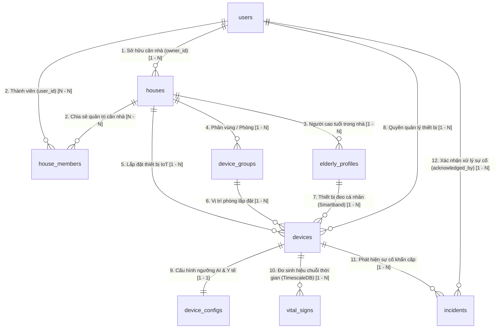

# 🗄️ Thiết Kế Cơ Sở Dữ Liệu – Smart Elderly Care AI (SECA)

> **Dự án tốt nghiệp Capstone 1 – Nhóm C1SE.34**  
> **Hệ quản trị CSDL:** PostgreSQL 16 + TimescaleDB Extension (Docker)  
> **Kiến trúc:** Hybrid Relational & Time-Series IoT Data  
> **Cập nhật:** 2026-09-28  

---

## 📌 1. Tổng Quan Kiến Trúc CSDL & Luồng Nghiệp Vụ

Cơ sở dữ liệu của hệ thống **Smart Elderly Care AI** được thiết kế chuẩn mực theo mô hình quản lý **Nhà thông minh & Chia sẻ gia đình (Smart Home & Family Care Sharing)**:

1. **Người nhà chính (Caregiver - Chủ nhà):**
   - Đăng ký tài khoản hệ thống bằng **Số điện thoại** cá nhân (ví dụ: `0905123456`).
   - Khởi tạo căn nhà giám sát (`houses`), tự động đóng vai trò là **Chủ nhà (`OWNER`)** với toàn quyền quản trị (`ADMIN`).
   - Tạo hồ sơ người cao tuổi (`elderly_profiles`), thiết lập các phòng (`device_groups`), và gán các thiết bị IoT (`devices`: Camera AI, Vòng đeo tay BLE).

2. **Cơ chế Chia Sẻ Căn Nhà (`house_members` - Quan hệ N-N):**
   - Người nhà chính có thể chia sẻ quyền truy cập căn nhà cho nhiều tài khoản khác:
     - **Thành viên gia đình (`MEMBER` / `EDIT`):** Con cái, anh chị em cùng theo dõi và nhận thông báo khẩn cấp khi cụ gặp sự cố.
     - **Bác sĩ y tế gia đình (`DOCTOR` / `VIEW`):** Bác sĩ được cấp quyền xem dữ liệu chuỗi thời gian sinh hiệu (nhịp tim, SpO2) và nhật ký sự cố để chẩn đoán.

3. **Dữ liệu Chuỗi Thời Gian (TimescaleDB Hypertable):**
   - Bảng `vital_signs` được chuyển đổi thành **Hypertable**, tự động phân vùng theo ngày để ghi nhận liên tục dữ liệu từ vòng đeo tay BLE (nhịp tim, nồng độ oxy trong máu SpO2, nhiệt độ da) với tốc độ cao.

---

## 📊 2. Sơ Đồ Thực Thể Liên Kết (ERD)


```mermaid
erDiagram
    users ||--o{ houses : "1. Sở hữu căn nhà (owner_id) [1 - N]"
    users ||--o{ house_members : "2. Thành viên (user_id) [N - N]"
    houses ||--o{ house_members : "2. Chia sẻ quản trị căn nhà [N - N]"
    houses ||--o{ elderly_profiles : "3. Người cao tuổi trong nhà [1 - N]"
    houses ||--o{ device_groups : "4. Phân vùng / Phòng [1 - N]"
    houses ||--o{ devices : "5. Lắp đặt thiết bị IoT [1 - N]"
    device_groups ||--o{ devices : "6. Vị trí phòng lắp đặt [1 - N]"
    elderly_profiles ||--o{ devices : "7. Thiết bị đeo cá nhân (Smartband) [1 - N]"
    users ||--o{ devices : "8. Quyền quản lý thiết bị [1 - N]"
    devices ||--|| device_configs : "9. Cấu hình ngưỡng AI & Y tế [1 - 1]"
    devices ||--o{ vital_signs : "10. Đo sinh hiệu chuỗi thời gian (TimescaleDB) [1 - N]"
    devices ||--o{ incidents : "11. Phát hiện sự cố khẩn cấp [1 - N]"
    users ||--o{ incidents : "12. Xác nhận xử lý sự cố (acknowledged_by) [1 - N]"
```

---

## 📑 3. Danh Sách 9 Bảng Cốt Lõi

| STT | Tên Bảng | Kiểu Bảng | Mục Đích Sử Dụng |
| :---: | :--- | :---: | :--- |
| **1** | `users` | Relational | Tài khoản người dùng hệ thống. Đăng nhập duy nhất bằng SĐT + Mật khẩu. Mặc định là `user`. |
| **2** | `houses` | Relational | Căn nhà thông minh / không gian giám sát (Chế độ: HOME, AWAY, NIGHT). |
| **3** | `house_members` | **Quan hệ N-N** | Bảng trung gian chia sẻ quyền quản trị căn nhà cho nhiều người thân & bác sĩ (`OWNER`, `CAREGIVER`, `DOCTOR`). |
| **4** | `elderly_profiles`| Relational | Hồ sơ người cao tuổi cần chăm sóc (tiền sử bệnh lý, số điện thoại người thân SOS). |
| **5** | `device_groups` | Relational | Các khu vực / phòng trong nhà (Phòng khách, Phòng ngủ, Phòng tắm...). |
| **6** | `devices` | Relational | Danh mục thiết bị IoT (Camera AI `SECA_001`, Vòng tay BLE `BLE_BAND_001`...). |
| **7** | `device_configs` | **Quan hệ 1-1** | Cấu hình ngưỡng cảnh báo y tế riêng biệt (SpO2 min, HR min/max, gia tốc té ngã). |
| **8** | `vital_signs` | **Hypertable** | Chuỗi thời gian sinh hiệu đo liên tục (HeartRate, SpO2, SkinTemp, FallFlag). |
| **9** | `incidents` | Relational + JSONB | Nhật ký sự cố khẩn cấp (Té ngã, Bất động, SOS) kèm clip video 5s và trạng thái xử lý. |

---

## 🔍 4. Báo Cáo Chuẩn Hóa CSDL (Đạt Chuẩn BCNF / 3NF)

CSDL đạt chuẩn **3NF (Third Normal Form)** và các bảng cốt lõi đạt **BCNF (Boyce-Codd Normal Form)**:

1. **Chuẩn 1NF (Tính nguyên tử):** Tất cả các cột đều chứa giá trị nguyên tử (Atomic values). Trường `extra_settings` sử dụng định dạng `JSONB` chuẩn SQL:2016 để lưu cấu hình mở rộng không cấu trúc của các cảm biến IoT đặc thù.
2. **Chuẩn 2NF (Không phụ thuộc một phần):** Tất cả các thuộc tính không khóa đều phụ thuộc hoàn toàn vào toàn bộ khóa chính. Các bảng khóa đơn (`users`, `houses`, `devices`...) mặc nhiên thỏa 2NF. Bảng khóa kết hợp `house_members(house_id, user_id)` và `vital_signs(id, time)` không có thuộc tính nào phụ thuộc vào một phần của khóa.
3. **Chuẩn 3NF / BCNF (Không phụ thuộc bắc cầu):** Mọi phụ thuộc hàm $X \rightarrow Y$ đều có $X$ là một **Siêu khóa (Superkey / Candidate Key)**.
   - Bảng `users`: $CK_1 = \{\text{id}\}$, $CK_2 = \{\text{phone}\}$ $\rightarrow$ Đạt 100% BCNF. Tài khoản độc lập, không gán cứng vai trò gia đình tại bảng `users`.
   - Bảng `house_members`: $CK_1 = \{\text{id}\}$, $CK_2 = \{\text{house\_id, user\_id}\}$ $\rightarrow$ Đạt 100% BCNF. Mọi vai trò (`role_in_house`) và quyền hạn (`permissions`) đều gắn liền với từng căn nhà cụ thể.

---

## 🚀 5. Hướng Dẫn Thực Thi CSDL Trên Docker

### Nạp Schema và Dữ liệu mẫu vào Docker:
```bash
# 1. Chạy container TimescaleDB (nếu chưa chạy)
docker compose up -d timescaledb

# 2. Khởi tạo cấu trúc 9 bảng (schema):
docker exec -i elderly_care_timescaledb psql -U postgres -d elderly_care < docs/database/database_schema.sql

# 3. Nạp dữ liệu mẫu khởi tạo (seed data):
docker exec -i elderly_care_timescaledb psql -U postgres -d elderly_care < docs/database/seed_sample_data.sql
```

---

## 🔑 6. Dữ Liệu Tài Khoản Mẫu Đăng Nhập

Tất cả các tài khoản mẫu sử dụng mật khẩu chung: **`12345678`**

| Số điện thoại | Họ và Tên | Vai trò tài khoản (`users`) | Vai trò căn nhà (`house_members`) | Quyền hạn (`permissions`) |
| :--- | :--- | :---: | :---: | :---: |
| **`0905123456`** | **Nguyễn Hữu Nghĩa** | `user` | **`OWNER`** (Chủ sở hữu / Người tạo nhà) | **`ADMIN`** (Toàn quyền quản trị) |
| **`0905999888`** | **Nguyễn Thị Lan** | `user` | **`CAREGIVER`** (Người thân được chia sẻ) | **`EDIT`** (Cùng cấu hình & điều khiển) |
| **`0905111222`** | **BS. Trần Văn Minh** | `user` | **`DOCTOR`** (Bác sĩ gia đình) | **`VIEW`** (Xem camera & sinh hiệu) |
